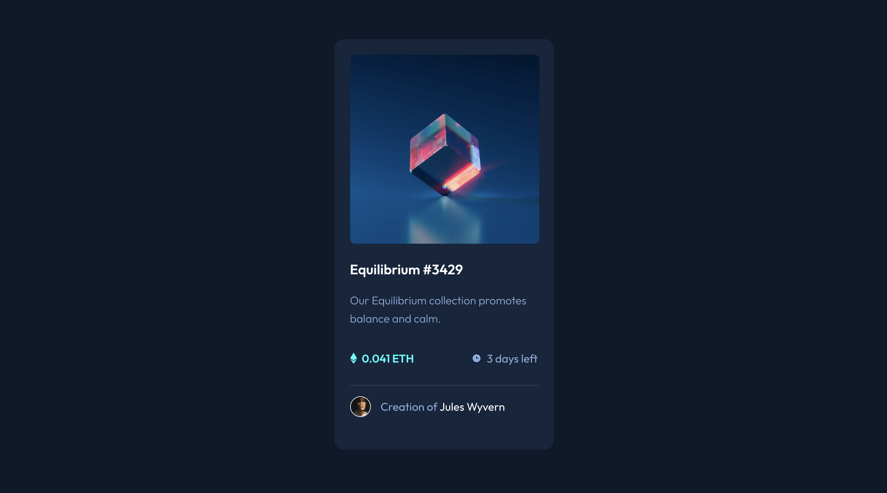

# Frontend Mentor - NFT preview card component solution

This is a solution to the [NFT preview card component challenge on Frontend Mentor](https://www.frontendmentor.io/challenges/nft-preview-card-component-SbdUL_w0U). Frontend Mentor challenges help you improve your coding skills by building realistic projects.

## Table of contents

- [Overview](#overview)
  - [The challenge](#the-challenge)
  - [Screenshot](#screenshot)
  - [Links](#links)
- [My process](#my-process)
  - [Built with](#built-with)
  - [What I learned](#what-i-learned)
  - [Continued development](#continued-development)
- [Author](#author)

## Overview

### The challenge

To build this preview card component and get it looking as close to the design as possible using only HTML and CSS. I decided to take it one step further and build the component in React.

Users should be able to:

- View the optimal layout depending on their device's screen size
- See hover states for interactive elements

### Screenshot

### Links

- Solution URL: [Github](https://github.com/MSPayneII/fem-nft-card-component)
- Live Site URL: [Netlify](https://your-live-site-url.com)

## My process

### Built with

- Semantic HTML5 markup
- Flexbox
- Mobile-first workflow
- [React](https://reactjs.org/) - JS library

### What I learned

I'm in the process of learning React by practice and repetition, working with hooks, and passing props to components. The goal was to start small with one component, gaining confidence before I move on to larger applications with more components.

### Continued development

I would like to continue working on my overall file structure, but that will come with more repetition and studying industry best practices.

I'd also like to continue working on my component creation and knowing what should and shouldn't be a component.

## Author

- Website - [Michael Payne](https://michaelspayneii.com/)
- Frontend Mentor - [@MSPayneII](https://www.frontendmentor.io/profile/MSPayneII)
- Github - [MSPayneII](https://github.com/MSPayneII)
